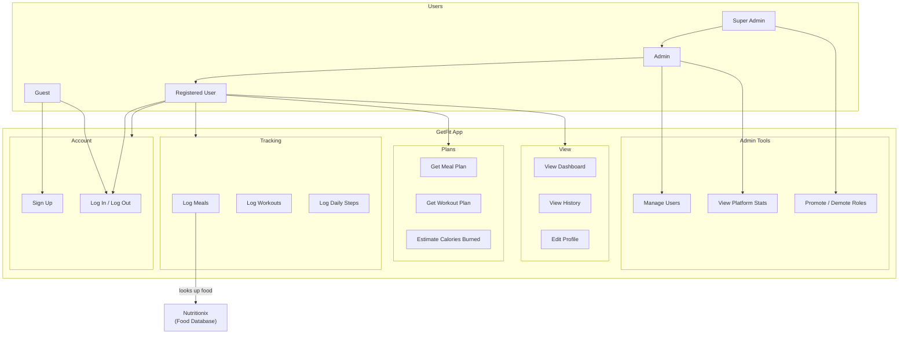
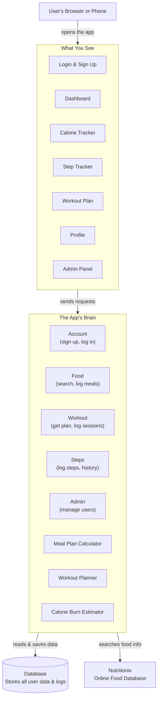

# GetFit — System Diagrams

---

## 1. Use Case Diagram
### Who uses the app and what can they do?



### What each user can do

| Feature | Guest | User | Admin | Super Admin |
|---|:---:|:---:|:---:|:---:|
| Sign Up / Log In | Yes | Yes | Yes | Yes |
| Track Food, Workouts & Steps | — | Yes | Yes | Yes |
| Get Personalised Plans | — | Yes | Yes | Yes |
| View Dashboard & History | — | Yes | Yes | Yes |
| Manage Users | — | — | Yes | Yes |
| Promote / Demote Roles | — | — | — | Yes |

---

## 2. System Design Diagram
### How does the app work?



### The three layers — simply

| Layer | What it does |
|---|---|
| **What You See** | The screens you interact with on your phone or browser |
| **The App's Brain** | Processes your actions, runs calculations, enforces rules |
| **Database** | Stores everything — your profile, logs, and history |

---

## 3. ER Diagram
### What data does the app store?

### How to read this diagram

| Shape | Meaning |
|---|---|
| **Rectangle** | A table — a type of data the app stores |
| **Oval** | A field — one piece of info inside that table |
| **Diamond** | A relationship — how two tables are linked |
| **(PK)** | The unique ID for each row in a table |

---



```mermaid
flowchart TB

    %% USER
    uid(["id (PK)"])
    uemail(["email"])
    uname(["username"])
    upass(["password"])
    uage(["age"])
    ugender(["gender"])
    uweight(["weight"])
    uheight(["height"])
    ugoal(["goal"])
    ufitness(["fitness_level"])
    uactivity(["activity_level"])
    ufreq(["workout_days"])
    uequip(["equipment"])
    urole(["is_admin / is_super_admin"])
    uactive(["is_active"])

    USER["USER"]

    uid      --- USER
    uemail   --- USER
    uname    --- USER
    upass    --- USER
    uage     --- USER
    ugender  --- USER
    uweight  --- USER
    uheight  --- USER
    ugoal    --- USER
    ufitness --- USER
    uactivity--- USER
    ufreq    --- USER
    uequip   --- USER
    urole    --- USER
    uactive  --- USER

    %% Relationships
    USER --- RF{"Logs Food"}
    USER --- RW{"Logs Workout"}
    USER --- RS{"Logs Steps"}

    %% FOOD LOG
    RF --- FL["FOOD LOG"]

    flid(["id (PK)"])
    flname(["food_name"])
    flcal(["calories"])
    flprot(["protein"])
    flcarbs(["carbs"])
    flfat(["fat"])
    flmeal(["meal_type"])
    fltime(["logged_at"])

    flid    --- FL
    flname  --- FL
    flcal   --- FL
    flprot  --- FL
    flcarbs --- FL
    flfat   --- FL
    flmeal  --- FL
    fltime  --- FL

    %% WORKOUT LOG
    RW --- WL["WORKOUT LOG"]

    wlid(["id (PK)"])
    wlex(["exercise_name"])
    wldur(["duration_min"])
    wlhr(["heart_rate"])
    wlcal(["calories_burned"])
    wlnotes(["notes"])
    wltime(["logged_at"])

    wlid    --- WL
    wlex    --- WL
    wldur   --- WL
    wlhr    --- WL
    wlcal   --- WL
    wlnotes --- WL
    wltime  --- WL

    %% STEP LOG
    RS --- SL["STEP LOG"]

    slid(["id (PK)"])
    slsteps(["steps"])
    slcal(["calories_burned"])
    sldate(["date"])

    slid    --- SL
    slsteps --- SL
    slcal   --- SL
    sldate  --- SL
```

### How the tables connect

```
USER
 |-- Logs Food    --> FOOD LOG    (many meals per user)
 |-- Logs Workout --> WORKOUT LOG (many sessions per user)
 |-- Logs Steps   --> STEP LOG    (one entry per day per user)

Deleting a user removes all their logs automatically.
```
